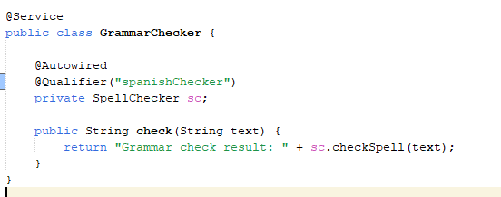
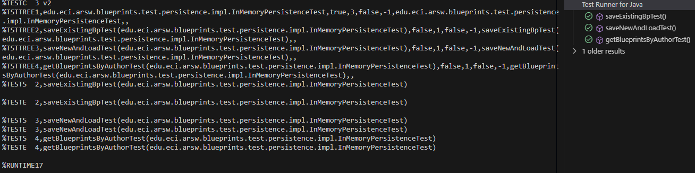

## Lab ARSW4

## Daniel Ricardo Ruge Gomez
### Taller

#### 1

 

#### 2 

#### 3

Con @Service, Spring detecta este bean gracias al component-scan,con @Autowired Spring inyecta la dependencia.
y Con @Qualifier("englishChecker") resolvemos el conflicto entre EnglishSpellChecker y SpanishSpellChecker.

#### 4 

programa de prueba y salida 

#### 5

ajustamos 

probamos

### Laboratorio

#### 1

dependencias:

configuracion:

anotaciones:

#### 2

extendemos BlueprintsPersistence

completamos los métodos getBlueprint y getBlueprintsByAuthor:

agregamos pruebas:

### 3 

Hacemos un programa en el que cree (mediante Spring) una instancia de BlueprintServices, y rectifique la funcionalidad del mismo.

### 4

creamos la abstraccion

filtro de redundancia:

filtrao de submuestreo:

Ajustamos BlueprintsServices para que use un filtro

configuramos un filtro:

### 5 

agregamos las pruebas

